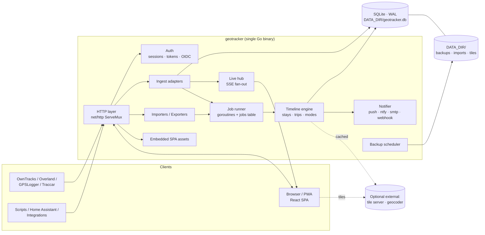

# GeoTracker — Project Specification

> **Status:** MVP plus most of v0.2–v0.4 implemented; see [Implementation status](#implementation-status-v01) · **License:** MIT · **Last updated:** 2026-10-01
> **Working name:** *GeoTracker*. Check GitHub, domain and trademark availability before the first public release, then rename if needed.

A self-hosted, privacy-first **location timeline and family location-sharing** app.
It gives you what Google Maps Timeline did, plus live family sharing, and it runs from **one small binary or container** that anyone can deploy, back up and upgrade.

---

## Table of Contents

1. [Vision, Goals and Non-Goals](#1-vision-goals-and-non-goals)
2. [Landscape: What We Learn From Existing Tools](#2-landscape-what-we-learn-from-existing-tools)
3. [Users and Personas](#3-users-and-personas)
4. [Guiding Principles](#4-guiding-principles)
5. [Feature Specification](#5-feature-specification)
6. [UX and UI Design](#6-ux-and-ui-design)
7. [System Architecture](#7-system-architecture)
8. [Tech Stack and Dependency Budget](#8-tech-stack-and-dependency-budget)
9. [Data Model](#9-data-model)
10. [Location Processing Pipeline](#10-location-processing-pipeline)
11. [API Design](#11-api-design)
12. [Integrations](#12-integrations)
13. [Multi-User, Family and Sharing Model](#13-multi-user-family-and-sharing-model)
14. [Security and Privacy](#14-security-and-privacy)
15. [Data Management: Backup, Restore, Export, Import, Retention](#15-data-management-backup-restore-export-import-retention)
16. [Performance Targets](#16-performance-targets)
17. [Deployment and Hosting Guide (Outline)](#17-deployment-and-hosting-guide-outline)
18. [Upgrades and Migration](#18-upgrades-and-migration)
19. [Configuration Reference](#19-configuration-reference)
20. [Observability and Operations](#20-observability-and-operations)
21. [Testing and Quality](#21-testing-and-quality)
22. [Repository Layout](#22-repository-layout)
23. [Roadmap](#23-roadmap)
24. [Decision Log (ADRs)](#24-decision-log-adrs)
25. [Open Questions](#25-open-questions)
26. [Glossary](#26-glossary)

---

## 1. Vision, Goals and Non-Goals

### Vision
*Your location history belongs to you.* A person or a family runs one lightweight server. Phones send locations to it. Everyone gets a clean timeline, useful insights and consent-based live sharing, and no third party sees the data.

### Goals
| # | Goal | How we measure it |
|---|------|------------------|
| G1 | **Easy to deploy** | From zero to a working instance with one `docker run` command in under 5 minutes. |
| G2 | **Easy to use** | A non-technical family member can set up a phone by scanning a QR code, with no typing of URLs or tokens. |
| G3 | **Lightweight** | Idle RAM under 50 MB. Runs well on a Raspberry Pi 4 or a $5 VPS. |
| G4 | **Data safety** | Automatic daily backups, one-click restore, full-fidelity export and import, and a backup before every upgrade. |
| G5 | **Family-first** | Groups, live sharing, geofence alerts and share links are core features. |
| G6 | **Modern, uncluttered UX** | Five top-level screens at most. Light and dark themes. Accessible (WCAG 2.2 AA). |
| G7 | **Few dependencies** | Every third-party library is justified in [§8](#8-tech-stack-and-dependency-budget). No Redis, no queue broker and no separate database server. |
| G8 | **Open** | MIT license, documented REST API and documented export format. No lock-in. |

### Non-Goals (for v1)
- **Our own native mobile app.** We rely on mature tracking apps such as OwnTracks and Overland ([ADR-006](#adr-006-no-native-mobile-app-in-v1-use-existing-tracking-apps)).
- **Fleet or enterprise tracking** with thousands of devices. The target is families and small groups of up to about 50 users per instance.
- **Turn-by-turn navigation or route planning.**
- **Multi-tenant SaaS hosting.** One instance belongs to one household or community.
- **Social network features** such as public profiles, likes or feeds.

---

## 2. Landscape: What We Learn From Existing Tools

> Stack and feature details below reflect public information at the time of writing. Verify them before quoting in public material.

| | Google Maps Timeline | Dawarich | GeoPulse | **GeoTracker (this project)** |
|---|---|---|---|---|
| Hosting | Google (moved to on-device storage in 2024–25) | Self-hosted | Self-hosted | Self-hosted |
| Typical stack | Proprietary | Ruby on Rails, PostgreSQL/PostGIS, Redis, Sidekiq | JVM backend, Vue frontend, PostgreSQL/PostGIS | **Go single binary + embedded React, SQLite** |
| Containers to run | n/a | Several (app, worker, DB, Redis) | Several (app, UI, DB) | **One** |
| Timeline (stays and trips) | Excellent | Yes | Strong focus | Yes, core |
| Family / live sharing | Separate product (Location Sharing) | Limited | Friends sharing | **Core: groups, live view, links, geofences** |
| Import Google data | n/a | Yes | Yes | Yes (all three Google formats) |
| License | Proprietary | AGPL-3.0 | Check project | **MIT** |

### What we keep
- **From Google Timeline:** the *day view* mental model (visits and trips as cards next to a map), automatic place recognition, and "where was I on…" recall.
- **From Dawarich:** a broad import and export story, support for many tracking clients, and statistics such as countries and cities visited.
- **From GeoPulse:** clean stay and trip detection, and a friendly sharing model.

### Gaps we target
1. **Operational weight.** Existing self-hosted options need a database server, sometimes Redis and background workers. We ship one process and one data directory.
2. **Family use is not first-class** elsewhere. Here it is.
3. **Backup and restore is often left to the admin** (`pg_dump` scripts). We build it in.
4. **UI density.** Many features on screen at once. We use progressive disclosure: simple by default, power features one click away.

> **Licensing note:** Dawarich is AGPL. We must **not copy code** from it or from any other copyleft project into this MIT codebase. Learning from behavior and public file formats is fine.

---

## 3. Users and Personas

| Persona | Needs | Design implications |
|---|---|---|
| **Admin / tech-savvy parent** ("Alex") | Deploys the server, manages users, cares about backups and upgrades. | CLI and UI both work. Clear docs. Health page. Automatic backups. |
| **Family member** ("Sam", not technical) | Wants to see the family on a map and their own timeline. | Big touch targets, QR onboarding, no jargon, PWA install. |
| **Quantified-self enthusiast** ("Priya") | Imports 10 years of Google data, wants stats, exports and an API. | Fast imports, rich insights, full API, many export formats. |
| **Managed member** (a child or an elderly parent) | Is shared with guardians. Must know they are shared. | Visible "who can see me" indicator. No hidden tracking ([§13](#13-multi-user-family-and-sharing-model)). |
| **Guest** (someone you share a link with) | Sees a temporary live location or trip. | No account needed. Link expires. Precision can be reduced. |

---

## 4. Guiding Principles

1. **One binary, one data directory.** Everything the app needs lives under `DATA_DIR`. To back up, copy it. To migrate, move it.
2. **Raw data is sacred; derived data is disposable.** GPS points are never changed by processing. Visits, trips and stats can be recomputed at any time ([ADR-009](#adr-009-raw-points-are-immutable-derived-data-is-recomputable)).
3. **Consent-first sharing.** Nobody is tracked without being able to see who sees them.
4. **Private by default.** No telemetry and no update checks unless you opt in. External calls (tiles, geocoding) are configurable and can be switched off entirely.
5. **Progressive disclosure.** A clean default screen, with advanced options behind "More" or in Settings.
6. **Boring technology.** Stdlib first, proven libraries second, new dependencies last.
7. **Every decision is written down** in the [Decision Log](#24-decision-log-adrs), with the reason and the trade-off.

---

## 5. Feature Specification

Legend: **MVP** = v0.1 · **v0.x** = planned minor release · **Later** = after 1.0 or on demand.

### 5.1 Location Ingestion
| Feature | Phase | Notes |
|---|---|---|
| OwnTracks (HTTP mode) | MVP | Most popular open-source tracker on Android and iOS. |
| Overland (iOS/Android) | MVP | Batched GeoJSON upload, battery-friendly. |
| GPSLogger (Android) | MVP | Custom URL mode. |
| Traccar Client / OsmAnd protocol | MVP | Simple GET/POST query parameters. |
| Generic JSON batch endpoint | MVP | For scripts, Home Assistant and custom devices. |
| Browser "share my location now" (PWA) | v0.2 | Foreground only; uses the Geolocation API. |
| Home Assistant integration | v0.4 | Starts as a documented REST/webhook recipe; a custom HA integration comes later. |
| Per-device tokens with QR setup | MVP | Scan the QR code in OwnTracks or Overland and the device is configured. |

### 5.2 Timeline
| Feature | Phase |
|---|---|
| Day view: vertical list of **visits** and **trips** synced with the map | MVP |
| Stay-point detection and trip segmentation ([§10](#10-location-processing-pipeline)) | MVP |
| Transport mode inference (walk, cycle, drive, train, flight) with confidence | MVP |
| Automatic reverse geocoding of visits (cached) | MVP |
| Week, month and custom-range views | v0.3 |
| Edit timeline: rename a visit, change a place, merge or split visits, fix a trip mode, hide or delete a range | v0.3 |
| Notes and tags on visits and days ("journal") | v0.3 |
| Photos on the timeline from Immich or PhotoPrism | v0.4 |
| Weather at visit time (Open-Meteo, free, no API key, opt-in) | Later |

### 5.3 Map
| Feature | Phase |
|---|---|
| Vector map (MapLibre GL) with light and dark styles that follow the theme | MVP |
| Layers: path line, raw points, visits, heatmap | MVP (heatmap v0.3) |
| Point inspector: time, accuracy, speed, altitude, battery, source | MVP |
| Date-range playback (animated replay of a day or trip) | v0.3 |
| Area search: "when was I ever here?" (draw a box or circle) | v0.3 |
| Fully offline maps via a self-hosted PMTiles file | v0.4 |

### 5.4 Places
| Feature | Phase |
|---|---|
| Saved places (Home, Work, School…) with name, icon, radius and category | MVP |
| Suggested places (frequently visited, not yet named) | v0.2 |
| Per-place stats: visit count, total time, first and last visit | v0.2 |
| Shared group places (e.g. "Grandma's house" visible to the whole family) | v0.2 |
| **Privacy zones:** points inside are hidden from others, or dropped at ingest | v0.2 |

### 5.5 Family and Sharing
| Feature | Phase |
|---|---|
| Groups (family, friends) with roles | v0.2 |
| Live map of group members with freshness and battery indicators | v0.2 |
| Per-member sharing controls: live on/off, history window, precision (exact, street, city) | v0.2 |
| Pause sharing / ghost mode (with an optional timer) | v0.2 |
| Share links for guests: live for N hours, or a fixed trip/day, with optional reduced precision | v0.2 |
| Geofence alerts: "notify me when Sam arrives at or leaves School" | v0.2 |
| Safety alerts: no update for X hours, low battery | v0.3 |
| "Who can see me" panel on every account | v0.2 |

### 5.6 Insights
| Feature | Phase |
|---|---|
| Dashboard: distance, time moving, places visited (day/week/month/year) | v0.3 |
| Countries and cities visited (from geocoding results, no extra dataset) | v0.3 |
| Distance by transport mode, time at top places | v0.3 |
| Heatmap for any range | v0.3 |
| **Year in Review** ("Wrapped"-style shareable summary) | v0.3 |
| Streaks and "firsts" (first visit to a new city) | Later |

### 5.7 Search and Navigation
| Feature | Phase |
|---|---|
| Command palette (`Ctrl/Cmd + K`): jump to a date, place, person or setting | v0.3 |
| Natural date input ("last friday", "2019-07") | v0.3 |
| Keyboard shortcuts (`←/→` previous/next day, `T` today, `/` search) | MVP |

### 5.8 Data Management
Detailed in [§15](#15-data-management-backup-restore-export-import-retention). Summary:
- Import: Google (all three formats), GPX, KML/KMZ, GeoJSON, CSV, OwnTracks `.rec`, Dawarich export, and our native archive. **Every import can be undone.**
- Export: native archive (lossless), GPX, GeoJSON, KML and CSV, for any range.
- Automatic scheduled backups with rotation, a backup before each upgrade, and one-click restore.
- Retention policies (e.g. drop raw points older than N years but keep visits and trips).

### 5.9 Administration
| Feature | Phase |
|---|---|
| First-run setup wizard (create admin, choose map style, connect first device) | MVP |
| User management (invite by link, disable, reset password, delete with data) | MVP |
| Instance settings in the UI (geocoder, tiles, registration, SMTP) | MVP |
| System page: version, DB size, point counts, background jobs, last backup | MVP |
| OIDC single sign-on (Authelia, Authentik, Keycloak, Pocket ID…) | v0.4 |
| Audit log (logins, sharing changes, exports, deletions) | v0.2 |

### 5.10 Notifications
Channels: **Web Push** (PWA), **ntfy**, **email (SMTP)** and **generic webhooks**. Events: geofence enter/exit, safety alerts, import finished and backup failed. Each user chooses channels per event type.

---

## 6. UX and UI Design

### 6.1 Information Architecture
Five primary destinations. Nothing else sits in the main navigation.

```
┌──────────────────────────────────────────────────────────┐
│  Map · Timeline · Places · Insights · Family    [⌘K] ((A)) │
└──────────────────────────────────────────────────────────┘
 Avatar menu → Settings (Profile, Devices, Data, Notifications, Appearance)
             → Admin (only for admins: Users, Instance, System)
```

**Why five:** more top-level items create the cluttered feel we want to avoid. Settings and Admin are visited rarely, so they live in the avatar menu. On mobile the five items become a bottom tab bar.

### 6.2 Key Screens

**Map (home)**: a full-bleed map. A floating, collapsible "people" card shows family members with their last-seen time. Date and layer controls float at the top.
```
┌───────────────────────────────────────────────┐
│ [Today ▾] [Layers ▾]                 [⌘K]      │
│                                               │
│   ┌────────────┐          (map)               │
│   │ (M) Mom  2m │                               │
│   │ (S) Sam  5m │     ●───●────●               │
│   │ (D) Dad 3h! │                               │
│   └────────────┘                               │
└───────────────────────────────────────────────┘
```

**Timeline (day view)**: the list on the left (bottom sheet on mobile) and the map on the right, always in sync. Hovering or tapping a card highlights it on the map.
```
┌────────────────────┬──────────────────────────┐
│ ◀  Tue, 29 Sep  ▶  │                          │
│ 12.4 km · 5 places │                          │
│ ─────────────────  │          (map)           │
│ [H] Home  00:00–08:10│                          │
│ [C] Drive 8.2 km 18m │                          │
│ [W] Work  08:30–17:45│                          │
│ [w] Walk  0.9 km 12m │                          │
│ [K] Café  18:00–18:40│                          │
└────────────────────┴──────────────────────────┘
```

**Places**: a list with search and filters beside a map. Suggested places show up as dismissible cards.
**Insights**: a card grid with a period switcher. Every chart links back to the timeline for its data.
**Family**: members, a sharing matrix ("who sees what"), share links and alerts.
**Settings → Data**: Import (drag and drop, per-file progress and report), Export (range and format), Backups (list, create, restore, download).

### 6.3 Onboarding (first run)
1. **Create admin account.** One form.
2. **Pick a map style.** Default is keyless; offline is optional.
3. **Connect your phone.** Show a QR code for OwnTracks and Overland, with 3-step instructions and screenshots.
4. **Optional:** import Google Timeline data (with a guide on where to find the file on your phone).
5. Done: land on the Map, with an empty state that says "waiting for the first location…" and updates live.

### 6.4 Design System
| Aspect | Choice | Why |
|---|---|---|
| Components | **shadcn/ui** (Radix primitives + Tailwind CSS) | The code is copied into our repo, so we own it and there is no runtime lock-in. Radix gives accessible behavior (focus, keyboard, ARIA). |
| Styling | Tailwind CSS v4 + CSS variables as design tokens | Themeable at runtime and small in production (unused CSS is purged). |
| Icons | lucide-react | Consistent, tree-shaken, MIT/ISC licensed. |
| Font | Inter (or Geist), **self-hosted** | No Google Fonts request, which protects privacy and works offline. |
| Themes | Light, Dark, System, plus 6 accent-color presets | CSS variables switch instantly. The map style switches with the theme. |
| Density | Comfortable (default) and Compact | Power users can fit more rows on screen. |
| Motion | 150–250 ms ease-out. Respects `prefers-reduced-motion`. | Motion should feel responsive without getting in the way. |

**Tokens (semantic, not raw colors):** `--background`, `--foreground`, `--card`, `--muted`, `--primary`, `--accent`, `--destructive`, `--border`, `--ring`, plus map-specific `--path`, `--visit`, `--heat-*`, and per-member colors from a colorblind-safe categorical palette.

### 6.5 UX Rules
- **Empty states teach.** Every empty screen says what to do next and gives one button.
- **Skeletons, not spinners,** for lists and cards. Optimistic updates for edits.
- **Undo instead of confirm** for reversible actions (hide a visit). Use a **typed confirmation** for irreversible ones (delete a user, delete a range).
- **No jargon in the default UI.** Say "Stay" rather than "stay point" and "Accuracy ±15 m" rather than "hacc". Technical detail goes in the point inspector.
- **Relative and absolute time together:** "5 min ago (14:32)".
- **Units and locale** are per user: km/mi, 24h/12h and first day of the week.
- **Accessibility:** WCAG 2.2 AA contrast. Everything works by keyboard. Focus rings are visible. Map information is also available as text (the timeline list is the accessible alternative to the map).
- **i18n from day one.** All strings go through translation keys ([ADR-020](#adr-020-i18n-from-day-one)).
- **Responsive:** mobile-first. Installable **PWA** with an offline shell.

---

## 7. System Architecture



### Components
| Component | Responsibility |
|---|---|
| **HTTP layer** | Routing, middleware (logging, auth, CSRF origin check, rate limit, security headers), JSON helpers. Serves the embedded SPA with an `index.html` fallback. |
| **Auth** | Local accounts (argon2id), session cookies, device and API tokens (stored hashed), optional OIDC. |
| **Ingest adapters** | One small file per protocol that translates to the internal `Point` struct. Validates, normalizes and deduplicates. |
| **Importers / Exporters** | Streaming parsers and writers for each file format. Run as jobs with progress. |
| **Timeline engine** | Pure functions: points → visits and trips. Incremental and idempotent. |
| **Job runner** | In-process worker pool. Jobs are stored in SQLite so they survive restarts ([ADR-003](#adr-003-no-redis-no-external-queue)). |
| **Live hub** | Keeps the latest location per user in memory and fans updates out to authorized SSE subscribers. |
| **Notifier** | Evaluates geofence and safety rules and sends through the configured channels. |
| **Backup scheduler** | Takes consistent snapshots with `VACUUM INTO`, rotates them and optionally verifies them. |

### Request flow example: phone sends a location
1. OwnTracks sends `POST /ingest/owntracks` with a device token.
2. The token is resolved to user and device, then the payload is parsed and validated.
3. The point is inserted (duplicates ignored), and the device's `last_seen_at` and battery are updated.
4. The live hub pushes the point to subscribers allowed to see it, after applying precision and privacy zones.
5. A debounced timeline job reprocesses that user from the last finalized visit onward.
6. Geofence rules are evaluated and notifications are sent.
7. The server returns `200` with an empty JSON array (OwnTracks expects a JSON response).

---

## 8. Tech Stack and Dependency Budget

**Rule:** a dependency is added only if (a) the stdlib or the browser cannot do it reasonably, (b) it is actively maintained, and (c) its license is compatible with MIT (MIT, BSD, ISC, Apache-2.0). Copyleft licenses (GPL, AGPL, LGPL) are not allowed ([ADR-016](#adr-016-mit-license-and-dependency-license-policy)).

### 8.1 Backend (Go, latest stable, ≥ 1.25)
| Need | Choice | Why |
|---|---|---|
| HTTP routing | **stdlib `net/http`** (method + path patterns since Go 1.22) | Removes a router dependency ([ADR-008](#adr-008-go-stdlib-router)). |
| Logging | **stdlib `log/slog`** | Structured JSON or text logs, no dependency. |
| Database driver | **`modernc.org/sqlite`** | Pure Go, so there is **no CGO**. That makes cross-compiling to ARM and building static binaries easy. |
| Migrations | **Tiny in-house runner** (~50 lines) + embedded `.sql` files | Forward-only numbered files. Not worth a dependency. |
| Password hashing | **`golang.org/x/crypto/argon2`** | Argon2id is the current OWASP recommendation. |
| OIDC (v0.4) | **`github.com/coreos/go-oidc/v3`** + `golang.org/x/oauth2` | Correct OIDC is security-critical and should not be hand-rolled. |
| Web Push (v0.2) | **`github.com/SherClockHolmes/webpush-go`** | VAPID and payload encryption (RFC 8291) are error-prone to hand-roll. |
| GPX / KML / JSON / CSV / ZIP | **stdlib** `encoding/xml`, `encoding/json`, `encoding/csv`, `archive/zip` | Enough for every format we support. |
| Email | **stdlib `net/smtp`** | Sufficient for notification mail. |
| Realtime | **Server-Sent Events** via stdlib | [ADR-004](#adr-004-server-sent-events-instead-of-websockets). |
| Static assets | **stdlib `embed`** | The SPA is compiled into the binary ([ADR-001](#adr-001-single-go-binary-with-embedded-spa)). |
| Metrics | **Hand-written Prometheus text format** at `/metrics` | Only a few counters and gauges are needed, so the Prometheus client library is not worth adding. |

**Total third-party Go modules at 1.0: about 4 direct dependencies.**

### 8.2 Frontend (React + TypeScript + Vite)
| Need | Choice | Why |
|---|---|---|
| Build | **Vite** | Fast development server, simple configuration. Dev-only. |
| UI kit | **shadcn/ui** (Radix + Tailwind) | [ADR-007](#adr-007-shadcnui--tailwind-for-the-ui). |
| Routing | **React Router** | Standard and stable. |
| Server state | **TanStack Query** | Caching, refetching, optimistic updates. Replaces most global state. |
| Client state | **React context + `useState`** | No Redux or Zustand needed at this size. |
| Map | **MapLibre GL JS** (BSD-3) | Open-source vector maps with WebGL performance, native heatmap and clustering ([ADR-005](#adr-005-maplibre--keyless-default-tiles--optional-offline-pmtiles)). |
| Offline tiles | **`pmtiles`** JS protocol | Reads a single `.pmtiles` file served by our binary. |
| Charts | **Recharts** | Matches the shadcn chart components. Enough for our dashboards. |
| Dates | **date-fns** + `date-fns-tz` | Tree-shakable and timezone-safe. |
| i18n | **i18next + react-i18next** | [ADR-020](#adr-020-i18n-from-day-one). |
| API types | **openapi-typescript** (dev-only) | Types are generated from `openapi.yaml`, so frontend and backend cannot drift apart ([ADR-014](#adr-014-hand-written-openapi-contract)). |
| Forms | **Native HTML validation + small helpers** | Our forms are small, so a form library is not justified yet. |
| Tests | **Vitest** (unit), **Playwright** (a few end-to-end smoke tests) | Dev-only. |

**Bundle budget:** initial JS under 250 KB gzipped (excluding MapLibre, which is lazy-loaded and about 250 KB). Each route is code-split.

---

## 9. Data Model

All timestamps are **UTC Unix milliseconds** (`INTEGER`). Coordinates are WGS84 decimal degrees (`REAL`). All IDs are `INTEGER PRIMARY KEY`, and public-facing tokens are random. See [ADR-010](#adr-010-utc-millisecond-timestamps-days-in-the-users-timezone).

```sql
-- ── Identity ───────────────────────────────────────────────
CREATE TABLE users (
  id            INTEGER PRIMARY KEY,
  email         TEXT NOT NULL UNIQUE COLLATE NOCASE,
  name          TEXT NOT NULL,
  password_hash TEXT,                        -- NULL for OIDC-only users
  role          TEXT NOT NULL DEFAULT 'user' CHECK (role IN ('admin','user')),
  timezone      TEXT NOT NULL DEFAULT 'UTC', -- IANA name, defines "day" boundaries
  prefs         TEXT NOT NULL DEFAULT '{}',  -- JSON: units, theme, locale, density
  color         TEXT,                        -- member color on maps
  disabled_at   INTEGER,
  created_at    INTEGER NOT NULL
);

CREATE TABLE sessions (
  id_hash    BLOB PRIMARY KEY,               -- SHA-256 of cookie value
  user_id    INTEGER NOT NULL REFERENCES users(id) ON DELETE CASCADE,
  expires_at INTEGER NOT NULL,
  user_agent TEXT, ip TEXT, created_at INTEGER NOT NULL
);

CREATE TABLE devices (
  id           INTEGER PRIMARY KEY,
  user_id      INTEGER NOT NULL REFERENCES users(id) ON DELETE CASCADE,
  name         TEXT NOT NULL,                -- "Pixel 9", "iPhone"
  client       TEXT NOT NULL,                -- owntracks|overland|gpslogger|osmand|api|browser
  last_seen_at INTEGER, last_battery INTEGER,
  created_at   INTEGER NOT NULL
);

-- One table for device ingest tokens and API tokens; scopes limit power.
CREATE TABLE tokens (
  id         INTEGER PRIMARY KEY,
  user_id    INTEGER NOT NULL REFERENCES users(id) ON DELETE CASCADE,
  device_id  INTEGER REFERENCES devices(id) ON DELETE CASCADE,
  name       TEXT NOT NULL,
  hash       BLOB NOT NULL UNIQUE,           -- SHA-256; plaintext shown once
  scopes     TEXT NOT NULL,                  -- e.g. "ingest" | "read" | "read,write"
  last_used_at INTEGER, expires_at INTEGER, created_at INTEGER NOT NULL
);

-- ── Raw data (immutable) ───────────────────────────────────
CREATE TABLE points (
  id        INTEGER PRIMARY KEY,
  user_id   INTEGER NOT NULL REFERENCES users(id) ON DELETE CASCADE,
  device_id INTEGER REFERENCES devices(id) ON DELETE SET NULL,
  import_id INTEGER REFERENCES imports(id) ON DELETE CASCADE,  -- undo an import = delete it
  ts        INTEGER NOT NULL,
  lat REAL NOT NULL, lon REAL NOT NULL,
  accuracy REAL, altitude REAL, speed REAL, bearing REAL,
  battery   INTEGER,
  flags     INTEGER NOT NULL DEFAULT 0,      -- bit0 outlier, bit1 hidden-by-user
  UNIQUE (user_id, ts)                       -- dedupe; ON CONFLICT DO NOTHING
);
-- The UNIQUE index (user_id, ts) also serves every time-range query.

-- ── Derived data (recomputable) ────────────────────────────
CREATE TABLE places (
  id         INTEGER PRIMARY KEY,
  user_id    INTEGER REFERENCES users(id) ON DELETE CASCADE,    -- owner
  group_id   INTEGER REFERENCES groups(id) ON DELETE CASCADE,   -- shared group place
  name TEXT NOT NULL, category TEXT, icon TEXT,
  lat REAL NOT NULL, lon REAL NOT NULL, radius_m REAL NOT NULL DEFAULT 75,
  address    TEXT, country_code TEXT, city TEXT,
  privacy    TEXT NOT NULL DEFAULT 'none' CHECK (privacy IN ('none','hide','drop')),
  created_at INTEGER NOT NULL
);

CREATE TABLE visits (
  id        INTEGER PRIMARY KEY,
  user_id   INTEGER NOT NULL REFERENCES users(id) ON DELETE CASCADE,
  place_id  INTEGER REFERENCES places(id) ON DELETE SET NULL,
  start_ts  INTEGER NOT NULL, end_ts INTEGER NOT NULL,
  lat REAL NOT NULL, lon REAL NOT NULL, radius_m REAL NOT NULL,
  geocode_id INTEGER REFERENCES geocode_cache(id),
  note      TEXT,
  locked    INTEGER NOT NULL DEFAULT 0       -- user-edited: reprocessing keeps it
);
CREATE INDEX visits_user_time ON visits(user_id, start_ts);

CREATE TABLE trips (
  id         INTEGER PRIMARY KEY,
  user_id    INTEGER NOT NULL REFERENCES users(id) ON DELETE CASCADE,
  start_ts   INTEGER NOT NULL, end_ts INTEGER NOT NULL,
  distance_m REAL NOT NULL,
  mode       TEXT NOT NULL,                  -- walk|cycle|drive|train|flight|unknown
  mode_confidence REAL,
  polyline   TEXT NOT NULL,                  -- simplified, encoded polyline
  locked     INTEGER NOT NULL DEFAULT 0
);
CREATE INDEX trips_user_time ON trips(user_id, start_ts);

CREATE TABLE geocode_cache (
  id       INTEGER PRIMARY KEY,
  cell     TEXT NOT NULL UNIQUE,             -- lat/lon rounded to ~11 m (4 decimals)
  provider TEXT NOT NULL,
  name TEXT, address TEXT, city TEXT, country_code TEXT,
  raw      TEXT, created_at INTEGER NOT NULL
);

-- ── Family & sharing ───────────────────────────────────────
CREATE TABLE groups (
  id INTEGER PRIMARY KEY, name TEXT NOT NULL, created_by INTEGER REFERENCES users(id),
  created_at INTEGER NOT NULL
);

CREATE TABLE group_members (
  group_id  INTEGER NOT NULL REFERENCES groups(id) ON DELETE CASCADE,
  user_id   INTEGER NOT NULL REFERENCES users(id) ON DELETE CASCADE,
  role      TEXT NOT NULL CHECK (role IN ('owner','admin','member')),
  managed   INTEGER NOT NULL DEFAULT 0,      -- sharing controlled by group admins (children)
  share_live      INTEGER NOT NULL DEFAULT 1,
  share_history_d INTEGER NOT NULL DEFAULT 0,       -- days of history visible (0 = none, -1 = all)
  precision       TEXT NOT NULL DEFAULT 'exact',    -- exact|street|city
  paused_until    INTEGER,                          -- ghost mode
  PRIMARY KEY (group_id, user_id)
);

CREATE TABLE share_links (
  id INTEGER PRIMARY KEY,
  user_id    INTEGER NOT NULL REFERENCES users(id) ON DELETE CASCADE,
  token_hash BLOB NOT NULL UNIQUE,
  kind       TEXT NOT NULL CHECK (kind IN ('live','range')),
  from_ts INTEGER, to_ts INTEGER,
  precision  TEXT NOT NULL DEFAULT 'exact',
  expires_at INTEGER NOT NULL, revoked_at INTEGER, created_at INTEGER NOT NULL
);

CREATE TABLE alert_rules (
  id INTEGER PRIMARY KEY,
  watcher_id INTEGER NOT NULL REFERENCES users(id) ON DELETE CASCADE,
  subject_id INTEGER NOT NULL REFERENCES users(id) ON DELETE CASCADE,
  kind       TEXT NOT NULL,                  -- enter|exit|stale|battery
  place_id   INTEGER REFERENCES places(id) ON DELETE CASCADE,
  threshold  INTEGER,                        -- minutes (stale) or percent (battery)
  channels   TEXT NOT NULL,                  -- JSON list
  enabled    INTEGER NOT NULL DEFAULT 1
);

-- ── Operations ─────────────────────────────────────────────
CREATE TABLE imports (
  id INTEGER PRIMARY KEY,
  user_id INTEGER NOT NULL REFERENCES users(id) ON DELETE CASCADE,
  filename TEXT NOT NULL, format TEXT NOT NULL,
  status   TEXT NOT NULL,                    -- queued|running|done|failed
  added INTEGER DEFAULT 0, duplicates INTEGER DEFAULT 0, rejected INTEGER DEFAULT 0,
  error TEXT, created_at INTEGER NOT NULL, finished_at INTEGER
);

CREATE TABLE jobs (
  id INTEGER PRIMARY KEY, kind TEXT NOT NULL, payload TEXT NOT NULL,
  status TEXT NOT NULL, attempts INTEGER NOT NULL DEFAULT 0,
  progress REAL, error TEXT, run_after INTEGER NOT NULL, updated_at INTEGER NOT NULL
);

CREATE TABLE settings (key TEXT PRIMARY KEY, value TEXT NOT NULL);  -- instance settings

CREATE TABLE audit_log (
  id INTEGER PRIMARY KEY, ts INTEGER NOT NULL, actor_id INTEGER,
  action TEXT NOT NULL, target TEXT, meta TEXT
);

CREATE TABLE schema_migrations (version INTEGER PRIMARY KEY, applied_at INTEGER NOT NULL);
```

### Storage estimate
- One point row is about **70–90 bytes** including the index.
- One point every 30 s all day is about 2,900 points per day, or roughly **1 M points per person per year, about 90 MB**.
- A family of 4 over 10 years is about 40 M points, or roughly **3.5 GB**. SQLite handles that comfortably.

### Why no spatial extension (PostGIS or R-tree) in v1
Almost every query is **"user X, time range Y"**, and the `(user_id, ts)` index serves that directly. Spatial questions ("when was I here?") run against `visits`, which is about 1,000× smaller than `points`, so a plain bounding-box scan is fast. **Revisit when** point-level area search over more than 10 M rows is too slow. SQLite's built-in R*Tree module can then be added without a new dependency.

---

## 10. Location Processing Pipeline

```
ingest → validate → dedupe → store raw → [live fan-out] → (debounced job) → clean → stays → trips → modes → place match → geocode → alerts
```

### 10.1 Validate and Normalize
- Reject: latitude outside [-90, 90] or longitude outside [-180, 180], timestamps more than 24 h in the future, and the null island point (0, 0).
- Normalize units: speed to m/s, and timestamps to UTC ms (handling seconds or ISO strings per client).
- Deduplicate on `(user_id, ts)`.

### 10.2 Clean (flags only, never deletes)
| Rule | Default | Why |
|---|---|---|
| Low accuracy | `accuracy > 100 m` is flagged as an outlier | Cell-tower fixes create jumps. |
| Impossible speed | Implied speed from the previous good point `> 350 m/s` | Faster than a commercial jet, so it is a glitch. |
| Spikes | Point A→B→C where B is far away and A≈C within 60 s | Classic GPS spike. |

Flagged points are hidden from the path but kept, and can be shown with a "Show filtered points" toggle.

### 10.3 Stay Detection (visits)
A stay-point algorithm with gap handling:
- A **stay** is a sequence of points within **D = 100 m** of their running centroid for at least **T = 5 min**.
- **Gap rule:** if points are missing for more than 30 min and the next point is still within D, the stay continues. Phones sleep when stationary, which is the most common cause of "broken" visits.
- A stay's center is the median of its points (robust to outliers), and its radius is the p80 distance.
- D and T can be tuned per user under "Timeline sensitivity" (Low, Normal, High presets rather than raw numbers).

### 10.4 Trips and Transport Mode
- A **trip** is everything between two consecutive stays.
- Distance is the sum of haversine distances over the non-flagged points.
- **Mode** comes from a heuristic on speed statistics (median, p95) and context:

| Mode | Rule of thumb |
|---|---|
| walk | p95 < 8 km/h |
| cycle | median 8–25 km/h and p95 < 35 km/h |
| drive | median > 20 km/h, road-like stops |
| train | sustained 60–300 km/h with few stops, long distance |
| flight | > 250 km/h, or a large jump across a gap (> 300 km in under 3 h) |
| unknown | too few points |

The confidence is shown in the UI, and users can correct the mode. Corrections lock the trip. **Why heuristics rather than ML:** they are transparent, need no training data or model files, run anywhere and are good enough for this purpose. An ML model can be added later if needed.

- The trip polyline is simplified (Douglas–Peucker, ~5 m tolerance) and stored encoded.

### 10.5 Place Matching and Suggestions
- A visit whose center falls within a saved place's radius is linked to that place.
- Unmatched visits are clustered with DBSCAN-style grouping (eps = 75 m). A cluster with 3 or more visits on different days becomes a **suggested place**.

### 10.6 Reverse Geocoding
- **Only visits are geocoded, never raw points.** That is thousands of calls rather than millions, which keeps us within free-tier rate limits and leaks less data ([ADR-012](#adr-012-reverse-geocode-visits-only-with-a-cache)).
- Lookups are cached by a rounded coordinate cell and shared across users.
- Providers: `none`, `nominatim` (public instance, max 1 req/s with a custom User-Agent, following its usage policy), `photon`, or a self-hosted Nominatim/Photon URL.

### 10.7 Incremental and Idempotent Processing
- After new points arrive, reprocess the window from the **start of the last visit** to now. Jobs are debounced to one per user per minute.
- An import reprocesses only the affected time range.
- Reprocessing deletes and recomputes visits and trips in the window, **except rows marked `locked`**.
- The admin can run "Rebuild timeline" for a user or for everyone after an algorithm upgrade.

### 10.8 Days and Timezones
A "day" is computed in the **user's configured timezone**. Automatic timezone detection from location while traveling needs a timezone boundary dataset of a few MB. That is deferred (see [Open Questions](#25-open-questions)).

---

## 11. API Design

- **Style:** REST + JSON, versioned under `/api/v1`. Errors use RFC 9457 (`application/problem+json`).
- **Contract:** a hand-written `openapi.yaml` that is served at `/api/docs` with a built-in viewer.
- **Auth:** a session cookie (browser) or `Authorization: Bearer <token>` (integrations).
- **Pagination:** cursor-based (`?cursor=…&limit=…`). Time ranges use `?from=…&to=…` in ISO-8601 or Unix ms.
- **Large responses** (points for a long range) are server-simplified by `?zoom=` or streamed as NDJSON.

### Main endpoints
| Area | Endpoints |
|---|---|
| Auth | `POST /auth/login` · `POST /auth/logout` · `GET /auth/oidc/*` · `GET /me` · `PATCH /me` |
| Points | `GET /points?from&to&user&zoom` · `POST /points` (batch) · `DELETE /points?from&to` |
| Timeline | `GET /timeline/day/{date}` · `GET /timeline?from&to` · `PATCH /visits/{id}` · `PATCH /trips/{id}` · `POST /visits/merge` · `POST /timeline/rebuild` |
| Places | `GET/POST /places` · `PATCH/DELETE /places/{id}` · `GET /places/suggestions` |
| Insights | `GET /insights/summary?period` · `GET /insights/heatmap?from&to&bbox` · `GET /insights/year/{yyyy}` |
| Search | `GET /search?q` (dates, places, people) · `GET /search/area?bbox&from&to` |
| Family | `GET/POST /groups` · `POST /groups/{id}/invites` · `PATCH /groups/{id}/members/{uid}` · `GET /live` (**SSE**) |
| Sharing | `GET/POST /share-links` · `DELETE /share-links/{id}` · public: `GET /s/{token}` |
| Alerts | `GET/POST /alerts` · `PATCH/DELETE /alerts/{id}` |
| Devices & tokens | `GET/POST /devices` · `GET /devices/{id}/setup` (QR payload) · `GET/POST/DELETE /tokens` |
| Data | `POST /imports` (multipart, resumable) · `GET /imports` · `DELETE /imports/{id}` (undo) · `POST /exports` · `GET /exports/{id}` |
| Admin | `GET/POST/PATCH /admin/users` · `GET/PUT /admin/settings` · `GET/POST /admin/backups` · `POST /admin/backups/{id}/restore` · `GET /admin/system` |
| Ops | `GET /healthz` · `GET /readyz` · `GET /metrics` · `GET /api/v1/version` |

### Ingest endpoints (outside `/api/v1`, stable forever)
`POST /ingest/owntracks` · `POST /ingest/overland` · `GET|POST /ingest/gpslogger` · `GET|POST /ingest/osmand` · `POST /ingest/json`

**Why a separate stable path:** phones are configured once and forgotten. These URLs must never break, even across API version changes.

---

## 12. Integrations

### 12.1 Inbound (tracking clients)
| Client | Platform | Setup |
|---|---|---|
| OwnTracks | Android, iOS | QR or config link that pre-fills the URL, mode and token. |
| Overland | iOS, Android | Setup link or QR that pre-fills the endpoint and token. |
| GPSLogger | Android | Copy-paste URL template shown in the UI. |
| Traccar Client | Android, iOS | Server URL plus device identifier. |
| Home Assistant | — | REST command or automation recipe in the docs. |
| Custom / scripts | — | `POST /ingest/json` with a token. |

> The exact QR and deep-link formats for each app will be verified against current app versions during implementation.

### 12.2 Import formats
| Source | Format | Notes |
|---|---|---|
| Google (legacy Takeout) | `Records.json` | Raw points. Can be several GB, so it is parsed as a stream. |
| Google (legacy Takeout) | Semantic Location History (monthly JSON) | Visits and activities, imported as locked visits and trips. |
| Google (on-device, 2024+) | `Timeline.json` exported from the phone | Semantic segments plus raw signals. |
| GPX | 1.0 / 1.1 | Tracks, routes, waypoints. |
| KML / KMZ | — | Including Google's legacy KML export. |
| GeoJSON | Point / LineString features | Timestamps from properties. |
| CSV | Any | UI column mapping with a preview of the first rows. |
| OwnTracks | `.rec` files | From the OwnTracks Recorder. |
| Dawarich | Its JSON export | For people migrating. |
| GeoTracker | Native archive | Lossless round-trip ([§15.4](#154-native-export-format)). |

### 12.3 Outbound
| Integration | Phase | Purpose |
|---|---|---|
| Webhooks (HMAC-signed) | v0.2 | Geofence events and new visits sent to any system (n8n, Node-RED, HA). |
| ntfy | v0.2 | Simple push notifications, self-hostable. |
| Web Push | v0.2 | Native PWA notifications. |
| SMTP email | v0.2 | Alerts and invites. |
| Immich / PhotoPrism | v0.4 | Show your photos on the timeline (read-only, per-user API key). |
| OIDC providers | v0.4 | SSO login. |

---

## 13. Multi-User, Family and Sharing Model

### 13.1 Roles
| Level | Role | Can |
|---|---|---|
| Instance | **admin** | Manage users, settings and backups. **Cannot read other users' locations** unless they share with the admin like anyone else. |
| Instance | **user** | Manage their own data, create groups, share. |
| Group | **owner / admin** | Invite and remove members, manage group places. Manage sharing for *managed* members. |
| Group | **member** | Sees what others share. Controls their own sharing. |

**Why the instance admin can't see everyone's location:** running the server should not give you a view into everyone's movements. The admin has database access, so this is policy enforced in the UI and API, not cryptography. It is documented honestly.

### 13.2 Sharing Rules
Visibility is **per member, per group**:
- `share_live`: whether the group sees my current position.
- `share_history_d`: how many days of my timeline the group can see (0 means none).
- `precision`: `exact`, `street` (~100 m grid) or `city` (~5 km grid). Coarsening happens **on the server** before data leaves it.
- `paused_until`: ghost mode. Others see "Location paused", not a stale position, so pausing is honest and visible.
- **Privacy zones** (places with `privacy = hide`) never appear to others. `drop` means those points are not stored at all.

### 13.3 Managed Members (children, dependents)
- A group admin can mark a member as **managed**, which lets the admin set that member's sharing options.
- **Consent-first:** a managed member always sees a persistent "Shared with: Mom, Dad" indicator and cannot be tracked invisibly. This is non-negotiable ([ADR-015](#adr-015-consent-first-sharing)).

### 13.4 Share Links (guests)
- A random 128-bit token (only its hash is stored), with a mandatory expiry (max 30 days, default 4 h for live links).
- The link can be revoked at any time. The page shows the sharer's name, the expiry countdown and nothing else about the instance.
- It is rate-limited and not indexed (`noindex`).

### 13.5 Enforcement Point
All filtering (sharing permissions, precision, privacy zones, pause) happens in **one function** on the server that every read path goes through: timeline, points, live SSE, share links and exports for others. **Why one place:** a sharing bug is a privacy breach, so there must be exactly one place to get it right and to test it.

---

## 14. Security and Privacy

| Area | Measure |
|---|---|
| Passwords | Argon2id (OWASP parameters). Minimum 10 characters, checked against a small built-in list of common passwords. |
| Sessions | Random 256-bit ID, stored hashed. Cookies are `HttpOnly`, `Secure` and `SameSite=Lax`. 30-day sliding expiry. The user can see and revoke sessions. |
| CSRF | `SameSite=Lax` plus an `Origin`/`Sec-Fetch-Site` check on every state-changing request. No CSRF tokens needed. |
| Tokens | Scoped (`ingest`, `read`, `write`), hashed at rest, shown once, with optional expiry. Device tokens are **ingest-only**, so a stolen phone cannot read history through its token. |
| Brute force | Per-IP and per-account rate limiting on login and share-link endpoints (in-memory token bucket). |
| Headers | Strict CSP (no inline scripts; tile hosts come from config), `X-Content-Type-Options`, `Referrer-Policy: same-origin`, `Permissions-Policy`. |
| Transport | HTTPS is required in production and handled by the reverse proxy. The app warns in the admin UI if `BASE_URL` is not HTTPS. |
| 2FA | Via the OIDC provider (v0.4). Native TOTP and passkeys are on the roadmap. |
| Uploads | Size limits, format sniffing, zip-bomb protection (limits on total uncompressed size and file count). Uploaded files are deleted after import. |
| Audit | Logins, sharing changes, token creation, exports, deletions and restores are all logged. |
| Data at rest | Use disk encryption (LUKS, BitLocker, encrypted ZFS). **Why not app-level encryption:** it would break queries and adds key management that most self-hosters would get wrong, which risks data loss. |
| Third parties | Tile and geocoder requests reveal the approximate areas you view. For maximum privacy, use offline PMTiles and `GEOCODER=none` or a self-hosted geocoder. |
| Telemetry | **None.** The update check is opt-in and sends only the version number. |
| Dependencies | `govulncheck` and `npm audit` in CI. Dependabot or Renovate for updates. |

---

## 15. Data Management: Backup, Restore, Export, Import, Retention

### 15.1 Backups
- **Mechanism:** SQLite `VACUUM INTO 'backup.db'`. It produces a consistent, compacted snapshot **while the app keeps running**, with no extra tools ([ADR-002](#adr-002-sqlite-as-the-only-database-in-v1)).
- **Schedule:** daily at 03:00 local time (configurable). Kept: 7 daily, 4 weekly and 6 monthly (configurable).
- **Location:** `DATA_DIR/backups/geotracker-YYYYMMDD-HHMMSS.db.gz`.
- **Verification:** after each backup, open it read-only and run `PRAGMA quick_check`. A failure triggers an admin alert.
- **Automatic pre-upgrade backup** before any migration runs ([§18](#18-upgrades-and-migration)).
- **Off-site:** the docs show how to sync `backups/` with **restic** or **rclone** (S3, B2, another NAS). **Why no built-in S3 upload in v1:** it would add a dependency and credential handling, and restic and rclone already do this better. Revisit if users ask for it.

### 15.2 Restore
- **UI:** Admin → Backups → Restore. The app validates the file, stops the job runner, swaps the DB atomically (the current DB is renamed to `*.pre-restore`), runs migrations if the backup is older, and restarts its internal services.
- **CLI:** `geotracker restore <file>` for cases where the server won't start.
- **Upload restore:** restore from a downloaded backup file on a fresh instance. This is also the server migration path.

### 15.3 Export (per user)
| Format | Content | Use case |
|---|---|---|
| **Native archive (.zip)** | Everything for the user: points, visits, trips, places, settings | Lossless backup of your own data, and moving between instances. |
| GPX | Tracks per day | Other GPS tools. |
| GeoJSON | Points and/or trip lines | GIS tools and scripts. |
| KML | Tracks | Google Earth. |
| CSV | Points | Spreadsheets and analysis. |

Every export can be filtered by date range. Large exports run as jobs; the user is notified when ready, and the download expires after 24 h.

### 15.4 Native Export Format
```
geotracker-export-2026-09-30.zip
├── manifest.json        {"format":"geotracker-export","format_version":1,
│                          "app_version":"0.3.0","exported_at":"…","user":{…},
│                          "counts":{"points":1234567,"visits":8123,…}}
├── points.ndjson        one JSON object per line (streamable, diff-friendly)
├── visits.ndjson
├── trips.ndjson
├── places.json
└── settings.json
```
**Why NDJSON in a zip:** it can be streamed without loading everything into memory, it is human-readable, and any language can parse it. The format is versioned, and newer versions of the app always import older formats.

### 15.5 Import Behavior
- **Chunked, resumable upload.** Multi-GB Google files survive a flaky connection.
- **Streaming parse.** Memory use stays flat regardless of file size.
- **Deduplication** on `(user_id, ts)`, so importing the same file twice is harmless.
- **Report:** added, duplicates, rejected (with reasons) and the time range covered.
- **Undo:** every imported point carries its `import_id`, so deleting the import removes exactly those points and recomputes the timeline.

### 15.6 Retention and Deletion
- Optional per-user policy: *delete raw points older than N years* (visits and trips are kept), or *delete everything older than N years*.
- "Delete range" in the timeline, with a typed confirmation.
- Account deletion removes all of the user's data (cascade) and is logged in the audit log.
- Deleted data can still exist in backups until they rotate out. **The UI states this clearly.**

---

## 16. Performance Targets

Reference hardware: **Raspberry Pi 4 (4 GB), SSD**, with 10 M points in the database.

| Metric | Target |
|---|---|
| Idle RAM | < 50 MB |
| Binary size / Docker image | < 40 MB / < 50 MB |
| Cold start (including migration check) | < 1 s |
| Day timeline API (p95) | < 100 ms |
| Live update latency (ingest → browser) | < 1 s |
| Ingest throughput (batch) | > 5,000 points/s |
| Google `Records.json` import, 1 M points | < 2 min |
| Map render of 1 year of points | Server simplifies by zoom; client draws < 50 k vertices |
| Frontend initial load (4G) | < 2 s to interactive |

### How we hit them
- **SQLite tuning:** WAL mode, `synchronous=NORMAL`, `busy_timeout=5000`, `foreign_keys=ON`, a 64 MB page cache, **one writer connection** plus a small reader pool (this avoids `SQLITE_BUSY` storms).
- **Batched inserts** in transactions for ingest and imports.
- **Server-side simplification** (Douglas–Peucker with a zoom-dependent tolerance) and grid aggregation for heatmaps.
- **Precomputed daily aggregates** (distance and time per mode) are updated with each reprocessing, so insights never scan raw points.
- **HTTP:** gzip/brotli for API responses, immutable caching for hashed SPA assets.

### Scaling ceiling (stated honestly)
SQLite has a single writer. That is plenty for families and communities (tens of users, hundreds of points per second). For hundreds of active users or a need for high availability, a PostgreSQL backend is on the "Later" roadmap. The SQL is kept portable to make that possible ([ADR-002](#adr-002-sqlite-as-the-only-database-in-v1)).

---

## 17. Deployment and Hosting Guide (Outline)

> The full guide will live in `docs/`. This section fixes its structure and the officially supported methods.

### 17.1 Supported Methods
| Method | Audience |
|---|---|
| **Docker / Docker Compose** (recommended) | Most self-hosters, NAS devices (Synology, Unraid, TrueNAS), VPS. |
| **Single binary + systemd** | Raspberry Pi and minimal VPS without Docker. |
| **Community templates** (Unraid CA, CasaOS, YunoHost, Helm) | Added once v1.0 is stable. |

Images and binaries are built for **linux/amd64, linux/arm64 and linux/arm/v7**, plus binaries for macOS and Windows for local testing.

### 17.2 Quick Start (Docker Compose)
```yaml
# docker-compose.yml
services:
  geotracker:
    image: ghcr.io/<org>/geotracker:latest   # pin a version in production, e.g. :0.3
    container_name: geotracker
    restart: unless-stopped
    ports:
      - "8080:8080"
    environment:
      GT_BASE_URL: "https://track.example.com"
      TZ: "Europe/Berlin"
    volumes:
      - ./data:/data
```
```bash
docker compose up -d
```
Then open the URL. The setup wizard creates the admin account.

### 17.3 Reverse Proxy and HTTPS (required for phones and PWA)
- **Caddy** (recommended, automatic HTTPS):
  ```
  track.example.com {
      reverse_proxy geotracker:8080
  }
  ```
- **Nginx** and **Traefik** examples in the docs, including the SSE settings (`proxy_buffering off;`, long read timeouts).
- **No public exposure?** Document **Tailscale / WireGuard**. Phones reach the server over the VPN and nothing is exposed to the internet.

### 17.4 Guide Chapters (to write)
1. Requirements and sizing (CPU, RAM, disk per user per year)
2. Install with Docker, Compose or binary + systemd (unit file provided)
3. Domain, HTTPS and reverse proxy (Caddy, Nginx, Traefik, Cloudflare Tunnel)
4. First-run wizard
5. Phone setup, one page per app with screenshots
6. Importing Google Timeline (how to get each format from Android, iOS or Takeout)
7. Family setup: groups, invites, sharing, alerts
8. Maps: default tiles, custom styles, fully offline PMTiles
9. Geocoding: public Nominatim etiquette, self-hosted Photon or Nominatim
10. Backups and off-site sync (restic/rclone recipes), restore drills
11. Upgrading and rolling back
12. Moving to a new server
13. SSO with OIDC (Authelia, Authentik, Keycloak, Pocket ID recipes)
14. Troubleshooting and FAQ (e.g. "my visits are split", "phone not sending")
15. API and integrations (Home Assistant, n8n, webhooks)

---

## 18. Upgrades and Migration

### 18.1 Upgrading
1. `docker compose pull && docker compose up -d` (or replace the binary and restart).
2. On start, the app detects pending migrations, **creates an automatic backup** (`backups/pre-upgrade-<version>.db.gz`), then applies the migrations in a transaction.
3. If a migration fails, it rolls back, the app refuses to start, and the log names the backup file to restore. The data is never left half-migrated.

- **Versioning:** SemVer. Breaking changes (config, API) happen only in major versions, with a migration guide. Before 1.0, breaking changes are called out in release notes.
- **Migrations are forward-only** ([ADR-017](#adr-017-forward-only-migrations-with-automatic-pre-migration-backup)). To downgrade, restore the pre-upgrade backup and run the old version.
- **Timeline algorithm updates** don't need migrations. They trigger an optional "Rebuild timeline" prompt for the admin.
- **Update notification:** opt-in check against GitHub releases, shown as a badge in Admin.

### 18.2 Moving to a New Server
Stop the app, copy `DATA_DIR`, start the app on the new host. That's it. Alternatively, download a backup in the UI and restore it on a fresh instance.

### 18.3 Migrating From Other Tools
| From | Path |
|---|---|
| Google Maps Timeline | Import any of the three formats ([§12.2](#122-import-formats)). |
| Dawarich | Use Dawarich's export, then import it here. Or point your phone apps at the new server; the ingest endpoints are compatible with the same clients. |
| OwnTracks Recorder | Import `.rec` files. |
| Anything else | GPX, GeoJSON, KML or CSV. |

---

## 19. Configuration Reference

**Principle:** environment variables are only for what's needed **before** the app can show a UI. Everything else is edited in **Admin → Settings** and stored in the database ([ADR-011](#adr-011-env-vars-for-bootstrap-ui-for-everything-else)).

| Variable | Default | Description |
|---|---|---|
| `GT_DATA_DIR` | `/data` | The database, backups, uploads and tiles all live here. |
| `GT_LISTEN` | `:8080` | Listen address. |
| `GT_BASE_URL` | *(required for production)* | Public URL; used for links, QR codes, cookies and CSP. |
| `GT_LOG_LEVEL` | `info` | `debug`, `info`, `warn` or `error`. |
| `GT_LOG_FORMAT` | `text` | `text` or `json`. |
| `GT_TRUSTED_PROXIES` | *(empty)* | CIDRs whose `X-Forwarded-For` header is trusted. |
| `GT_ADMIN_EMAIL` / `GT_ADMIN_PASSWORD` | *(empty)* | Optional headless bootstrap of the first admin (automation). |
| `TZ` | `UTC` | Server timezone for backup scheduling. |

**UI settings** (stored in DB): registration (closed, invite-only, open), map style URL and attribution, offline tiles file, geocoder provider and URL, SMTP, ntfy server, backup schedule and retention, default timeline sensitivity, OIDC, update-check opt-in.

Secrets such as the session key and VAPID keys are **generated on first start** and stored in `DATA_DIR`, so there are no secrets to invent at install time.

---

## 20. Observability and Operations

- **Health:** `/healthz` (process up) and `/readyz` (DB reachable, migrations applied), used by Docker `HEALTHCHECK`.
- **Metrics:** `/metrics` in Prometheus text format: points ingested, ingest errors, job queue depth, job durations, DB size, last backup time, SSE subscribers. Access requires an admin token or a trusted network.
- **Logs:** structured with `slog`. Every request has an ID. **Coordinates are never logged at `info` level** (privacy).
- **Admin → System page:** version, uptime, DB and backup sizes, points per user, jobs (running, failed, with retry), last backup status, and warnings (non-HTTPS base URL, backups failing, disk nearly full).
- **CLI subcommands** (same binary): `serve` (default), `backup`, `restore <file>`, `migrate`, `user reset-password <email>`, `rebuild-timeline [--user]`, `version`.

---

## 21. Testing and Quality

| Layer | Approach |
|---|---|
| Parsers (ingest and import) | Table-driven Go tests over **anonymized fixture files** for each format and client version. |
| Timeline engine | **Golden tests:** synthetic and real-world anonymized traces run against expected visits and trips. Any algorithm change shows up as a readable diff. |
| Sharing enforcement | Dedicated test matrix (role × precision × pause × privacy zone × endpoint). **Required to pass**, since it is the highest-risk code. |
| API | Integration tests against a temporary SQLite DB through the real HTTP handler. |
| Migrations | Test upgrade from each released schema version with sample data. |
| Frontend | Vitest for logic (formatters, hooks). **Playwright** smoke tests for setup wizard, login, day view, import and share link. |
| Accessibility | axe checks in Playwright, plus manual keyboard and screen-reader checks before releases. |
| Performance | Benchmark suite (`go test -bench`) on the 10 M-point dataset. CI flags regressions over 20%. |
| CI (GitHub Actions) | `go vet`, `staticcheck`, `govulncheck`, tests, `tsc`, ESLint, Vitest, Playwright, multi-arch image build. Releases are built on tags. |

---

## 22. Repository Layout

```
geotracker/
├── cmd/geotracker/          main.go: CLI subcommands, wiring
├── internal/
│   ├── server/              HTTP handlers, middleware, routes, SSE hub
│   ├── auth/                passwords, sessions, tokens, OIDC
│   ├── store/               SQL queries + migrations/*.sql (embedded)
│   ├── ingest/              owntracks.go, overland.go, gpslogger.go, osmand.go, json.go
│   ├── transfer/            importers + exporters (google, gpx, kml, geojson, csv, native)
│   ├── timeline/            stays, trips, modes, places (pure functions + golden tests)
│   ├── geo/                 haversine, simplify, grid coarsening, polyline encoding
│   ├── geocode/             nominatim, photon, cache
│   ├── share/               THE visibility filter (§13.5)
│   ├── notify/              webpush, ntfy, smtp, webhook, alert rules
│   ├── jobs/                job runner
│   └── backup/              VACUUM INTO, rotation, restore
├── web/                     React app (Vite); `dist/` embedded into the binary
│   └── src/{routes,components,components/ui,lib,api,i18n,styles}
├── docs/                    user + admin guide (published as a static site)
├── deploy/                  docker-compose.yml, Caddyfile, nginx.conf, geotracker.service
├── testdata/                anonymized fixtures and traces
├── openapi.yaml             API contract
├── Dockerfile               multi-stage: node build → go build → distroless/static
├── Makefile                 dev, build, test, release
├── LICENSE                  MIT
├── CONTRIBUTING.md · SECURITY.md · CHANGELOG.md
└── README.md
```
**Why flat `internal/` packages:** one package per domain concept, no layered "controllers/services/repositories" ceremony. A newcomer can find any feature by its name.

---

## 23. Roadmap

| Phase | Version | Scope | Exit criteria |
|---|---|---|---|
| **0: Foundations** | — | Repo, CI, Go server skeleton, SQLite + migrations, auth, embedded SPA, design system, theming, i18n setup | Login works end to end in the Docker image on amd64 and arm64. |
| **1: MVP** | v0.1 | Ingest (OwnTracks, Overland, GPSLogger, OsmAnd, JSON), QR device setup, Map, Day timeline (stays, trips, modes), geocoding, Google + GPX import, native export/import, automatic backups and restore, setup wizard, user management | One person can replace Google Timeline. |
| **2: Family** | v0.2 | Groups, live map (SSE), sharing controls, ghost mode, share links, places + suggestions, privacy zones, geofence alerts, notifications (push, ntfy, email, webhook), audit log, PWA | A family of 4 uses it daily. |
| **3: Insights and Editing** | v0.3 | Insights dashboard, heatmap, year in review, countries and cities, timeline editing, notes, range views, playback, area search, command palette, safety alerts | Feature parity with the timeline tools listed in §2. |
| **4: Integrations** | v0.4 | OIDC, Immich/PhotoPrism photos, Home Assistant recipe, offline PMTiles, KML/CSV/Dawarich importers, more languages | Covers the common integration requests. |
| **1.0: Stable** | v1.0 | API freeze, docs site complete, security review, performance targets verified, community templates | Public launch. |
| **Later** | — | PostgreSQL backend, native TOTP and passkeys, auto timezone, native companion app, S3 backup target, weather, streaks | Driven by user demand. |

---

## 24. Decision Log (ADRs)

Each entry records the decision, **why** we made it, what we gave up, and when to revisit it.

#### ADR-001: Single Go binary with embedded SPA
- **Decision:** The React build is embedded in the Go binary with `embed`. One process serves both the API and the UI.
- **Why:** One artifact to deploy, version and upgrade. The UI and API versions can never mismatch. No Nginx is needed inside the container.
- **Trade-off:** The frontend can't be deployed separately. That isn't a real need for a self-hosted app.

#### ADR-002: SQLite as the only database in v1
- **Decision:** SQLite through pure-Go `modernc.org/sqlite`, in WAL mode, as the only supported database.
- **Why:** Nothing extra to run, tune or secure. Backups are one file (`VACUUM INTO`). Migrating means copying a directory. It is fast enough for family scale (see [§16](#16-performance-targets)). Pure Go means no CGO, so ARM cross-compiles are trivial. Supporting two databases from the start would double the testing work.
- **Trade-off:** Single writer. No PostGIS. Not suited to hundreds of concurrent heavy users.
- **Revisit when:** a real deployment needs more than ~100 active users or high availability. The SQL is kept portable and data access lives in one package (`store`), so the change stays contained.

#### ADR-003: No Redis, no external queue
- **Decision:** Background work runs in in-process goroutines. Jobs are persisted in a SQLite `jobs` table.
- **Why:** Redis and Sidekiq-style workers are the main source of operational weight in comparable tools. Our job volume is small, and persisting jobs in SQLite means they survive restarts.
- **Trade-off:** Jobs can't be spread across multiple machines. That isn't needed at our scale.

#### ADR-004: Server-Sent Events instead of WebSockets
- **Decision:** Live location updates use SSE (`text/event-stream`).
- **Why:** The data flows one way (server to browser). SSE is plain HTTP: the stdlib can serve it, it passes through proxies, reconnects automatically in browsers, and needs no extra library on either side.
- **Trade-off:** Reverse proxies need buffering turned off, which is documented. If bidirectional realtime is ever needed, WebSockets can be added.

#### ADR-005: MapLibre + keyless default tiles + optional offline PMTiles
- **Decision:** MapLibre GL JS for rendering. The default basemap is a free, keyless vector tile service (e.g. OpenFreeMap). Any style URL can be configured, and a local `.pmtiles` file can be used for fully offline maps.
- **Why:** Vector maps look modern, theme cleanly (light and dark) and render large data fast. A keyless default means the app works right after install. PMTiles gives maximum privacy with zero extra code on the server, because the stdlib `http.ServeContent` already supports the HTTP range requests PMTiles needs.
- **Trade-off:** The default tiles depend on a third-party service's availability. Mitigations: configurable fallback styles and the offline option. OpenStreetMap attribution must always be displayed (ODbL).

#### ADR-006: No native mobile app in v1; use existing tracking apps
- **Decision:** Support OwnTracks, Overland, GPSLogger and Traccar Client instead of building our own app.
- **Why:** Reliable background location on iOS and Android is very hard (battery, OS restrictions, app store review). These apps have had years to get it right. We make setup easy with QR codes and put our effort into the server and web UX. The PWA covers viewing and sharing.
- **Trade-off:** Setup involves a second app, which slightly weakens the "one app" feel. **Revisit** after 1.0 if demand is strong.

#### ADR-007: shadcn/ui + Tailwind for the UI
- **Decision:** shadcn/ui components (Radix primitives) styled with Tailwind and CSS variable tokens.
- **Why:** The component source lives in our repo, so there is no runtime dependency to break on upgrade and everything is fully customizable. Radix provides accessible behavior. CSS variables make themes and accent colors trivial. This combination currently has the largest ecosystem for modern React UIs.
- **Trade-off:** We maintain the copied component code ourselves. That's acceptable because it's small and rarely changes.

#### ADR-008: Go stdlib router
- **Decision:** Use `net/http.ServeMux` (method and wildcard patterns, Go 1.22+) instead of chi, gin or echo.
- **Why:** It covers everything we need. Middleware is just `func(http.Handler) http.Handler`. One less dependency to track.
- **Trade-off:** A few helpers to write by hand (JSON response and error helpers), roughly 50 lines.

#### ADR-009: Raw points are immutable; derived data is recomputable
- **Decision:** Processing never modifies or deletes raw points. It only sets flags. Visits, trips and aggregates can always be rebuilt.
- **Why:** Algorithm improvements benefit all historical data. Bugs in processing can't destroy data. Imports can be undone precisely.
- **Trade-off:** Raw storage grows. It is manageable ([§9](#9-data-model)), and retention policies exist.

#### ADR-010: UTC millisecond timestamps; days in the user's timezone
- **Decision:** Store `INTEGER` UTC milliseconds. "Days" are computed in the user's IANA timezone.
- **Why:** Integers are compact, fast to index and unambiguous. Millisecond precision avoids collisions in dense tracks.
- **Trade-off:** Days while traveling across timezones use the home timezone until automatic timezone detection exists.

#### ADR-011: Env vars for bootstrap, UI for everything else
- **Decision:** Only about 6 environment variables. All other settings are editable in the Admin UI and stored in the database.
- **Why:** Non-technical admins shouldn't edit YAML files and restart containers to change SMTP settings. Settings in the database are also included in backups.
- **Trade-off:** Fully declarative configuration (GitOps) is weaker. `GT_ADMIN_*` and a future `geotracker settings import` command cover automation.

#### ADR-012: Reverse-geocode visits only, with a cache
- **Decision:** Geocode visits (stays), not raw points. Cache results by rounded coordinate cell and share the cache across users.
- **Why:** About 1000× fewer external calls. That fits free services' rate limits, is faster, and reveals less about the user to the provider.
- **Trade-off:** Individual points have no address. They don't need one.

#### ADR-013: Native export = zip of NDJSON + versioned manifest
- **Decision:** See [§15.4](#154-native-export-format).
- **Why:** Streamable, human-readable, easy to parse in any language, and versioned for forward compatibility. It builds trust that there's no lock-in.
- **Trade-off:** Larger than a binary format before compression. After zip compression the difference is negligible.

#### ADR-014: Hand-written OpenAPI contract
- **Decision:** `openapi.yaml` is the source of truth. TypeScript types are generated from it. Go handlers are written by hand, and a CI test checks that routes and spec match.
- **Why:** The API is a product feature for integrators, so it deserves deliberate design. Generating types keeps the frontend honest without heavy server-side codegen frameworks.
- **Trade-off:** The spec has to be edited alongside the code. The CI check enforces this.

#### ADR-015: Consent-first sharing
- **Decision:** Every person can always see who can see their location. Pausing is visible to others as "paused". There is no covert mode.
- **Why:** Family location apps can be misused for stalking or control. Our design makes misuse visible. It is also a clear product value.
- **Trade-off:** Some users may want silent tracking of dependents. We won't provide it.

#### ADR-016: MIT license and dependency license policy
- **Decision:** The project is MIT. Only permissively licensed dependencies are allowed (MIT, BSD, ISC, Apache-2.0). No code is copied from copyleft projects.
- **Why:** MIT gives the widest freedom to use, embed and fork. A copyleft dependency would make that promise false.
- **Trade-off:** Some copyleft libraries are off-limits. A license check runs in CI.

#### ADR-017: Forward-only migrations with automatic pre-migration backup
- **Decision:** Numbered `.sql` migrations that run automatically at startup, with a backup first. No down-migrations.
- **Why:** Down-migrations are rarely tested and often lose data. Restoring a backup is the reliable way to roll back. Automatic migrations mean upgrading is "pull and restart".
- **Trade-off:** Rolling back loses data written after the upgrade. This is documented.

#### ADR-018: Local accounts + optional OIDC, no bundled identity provider
- **Decision:** Built-in email and password accounts, with optional OIDC SSO.
- **Why:** It works out of the box for families (no Keycloak needed), and homelab users with an existing IdP get SSO and 2FA through it.
- **Trade-off:** Native 2FA waits until later. Users who need it now can use OIDC.

#### ADR-019: Cookie sessions for the browser, not JWT
- **Decision:** Opaque, server-stored session IDs in cookies. Bearer tokens only for devices and integrations.
- **Why:** Sessions can be revoked instantly (a lost phone, a removed family member), there is no token-in-localStorage XSS exposure, and the implementation is simpler.
- **Trade-off:** One database lookup per request. It's cached and negligible.

#### ADR-020: i18n from day one
- **Decision:** All UI strings go through i18next keys from the first commit. English ships first.
- **Why:** A family app has a global audience. Adding i18n to an existing codebase means touching every component.
- **Trade-off:** Slightly more friction when writing UI strings.

### Decisions made during implementation

#### ADR-021: Places are matched to visits at read time
- **Decision:** Visits store only coordinates. The API matches them to saved places (nearest place whose radius contains the visit) when the timeline is read. There is no `place_id` column.
- **Why:** Adding, moving or deleting a place takes effect instantly for all history, with no rebuild. It costs one small in-memory loop per request.
- **Revisit when:** group-shared places (v0.2) make matching per-viewer. The same function still works, it just gets more places.

#### ADR-022: No generic jobs table
- **Decision:** A `users.timeline_dirty_from` marker drives timeline rebuilds, and the `imports` table is the import queue. Both survive restarts.
- **Why:** These are the only two kinds of background work in the MVP. A generic job system would be an abstraction with two users.
- **Revisit when:** a third kind of persistent background work appears (e.g. scheduled exports).

#### ADR-023: Custom controls, no browser-native widgets (revised 2026-10-01)
- **Decision:** Every visible control is our own component in `web/src/components/controls.tsx`: calendar, date picker, date/time range picker with presets, time field, select/listbox, slider, stepper, checkbox, switch and radio cards. Only plain text inputs and the invisible `<dialog>` container remain native. Still no Radix dependency.
- **Why:** Native date, time and select widgets look different on every OS and browser, can't show extras such as "days with data" dots, and made the product feel generic (product owner's call). All the components are keyboard-accessible (ARIA roles, arrow keys, Esc) and render through a small portal-based `Popover`, so they work inside dialogs too.
- **Trade-off:** About 700 lines of UI code we own and maintain.

#### ADR-031: One access function for other people's data
- **Decision:** `store.AccessTo(viewer, subject)` combines the subject's sharing choices over all groups they share with the viewer (any live, widest history window, exact only if some group gets exact, nothing while paused). `/points`, `/timeline`, `/family` and alert creation all call it. Live events carry no coordinates; clients refetch through the same check.
- **Why:** A sharing bug is a privacy breach (spec §13.5), so there is exactly one function to get right, and it is covered by a dedicated test.
- **Not yet:** guardian-managed members. That needs a careful consent design first, so it stays out until then.

#### ADR-032: Retention never rewrites derived data
- **Decision:** Deleting old raw points doesn't trigger a timeline rebuild. Visits and trips computed earlier stay as they are.
- **Why:** A rebuild starting before the cutoff would recompute from missing points and silently drop old visits (caught by a test). The UI says that a manual full rebuild can only use the points that remain.

#### ADR-028: Offline maps from MBTiles through the existing SQLite driver
- **Decision:** An admin points GeoTracker at a `.mbtiles` file. The server reads tiles with the same pure-Go SQLite driver, flips TMS rows to XYZ, passes gzip through, and generates a light/dark MapLibre style (a tailored one for the OpenMapTiles schema, a generic one for other vector schemas, or a raster style).
- **Why:** Fully offline, private maps with **no new dependency** and no separate tile server. Label glyphs stay configurable: online by default, or empty for 100% offline.
- **Revisit when:** users want PMTiles or sprite icons. Both can be served the same way.

#### ADR-029: Notifications are evaluated in-process, delivered by stdlib SMTP and Gotify HTTP
- **Decision:** Arrive/leave events are detected on ingest, with hysteresis (radius + max(25 m, accuracy)) and only for fixes newer than 15 minutes. Silent devices are checked every minute. The last known state lives in memory; after a restart the first fix only re-learns state, so there are no false alerts.
- **Why:** No broker, no push service, no extra dependency. The same pipeline serves family geofences in v0.2.

#### ADR-030: Native apps authenticate with device-bound bearer tokens
- **Decision:** `POST /api/v1/auth/token` issues a `read,write,ingest` token tied to a device entry. Tracker-app tokens stay `ingest`-only. The API documentation lives in `the wiki ("API" page, source in docs/API.md)` (this supersedes ADR-027's deferral for integrators; `openapi.yaml` follows when the API freezes at 1.0).
- **Why:** One token model for phones, scripts and a future Android app. Revocation is just "remove device", which users already understand.

#### ADR-024: Restore by staged file + restart
- **Decision:** A restore validates the backup and stages it as `restore.db`, then the process exits. On the next start, a safety snapshot of the current DB is taken and the files are swapped before anything opens them.
- **Why:** Hot-swapping a database under open connections is complex and risky. With Docker (`unless-stopped`) or systemd (`Restart=always`) the restart is automatic.
- **Trade-off:** Unsupervised processes must be started again by hand. The UI and docs say so.

#### ADR-025: Day boundaries use the browser's timezone (MVP)
- **Decision:** The UI computes "a day" in the viewer's local timezone and sends plain UTC ranges. The server stays timezone-agnostic.
- **Why:** This needs zero server code, and it is correct for the common case. It narrows ADR-010's per-user timezone setting until auto-timezone (Q2) is decided.

#### ADR-026: Google "semantic" history is imported as points
- **Decision:** Legacy Semantic Location History and on-device Timeline segments become raw points (visit start and end, path points). Our own engine then derives visits and trips.
- **Why:** One consistent timeline model, and the result is recomputable (ADR-009). When `Records.json` is present in the same Takeout zip, it wins and semantic files are skipped to avoid duplicate points.
- **Trade-off:** Google's place names are not kept. Our geocoder names the places instead.

#### ADR-027: OpenAPI contract deferred to v0.2
- **Decision:** The TypeScript API types are hand-written in `web/src/lib/api.ts` for now. ADR-014's `openapi.yaml` lands when the API stabilizes after family sharing (v0.2).
- **Why:** The API changed daily during the MVP. A spec written now would be rewritten several times.

### Implementation status (v0.1)

| Area | Status |
|---|---|
| Ingest: OwnTracks, Overland, GPSLogger, Traccar (OsmAnd + JSON), generic JSON; per-device ingest-only keys; QR setup | ✅ |
| Timeline engine: stays with silent-gap handling, drift merging, spike filter, trips, mode heuristics | ✅ tested |
| Reverse geocoding (Nominatim/Photon/off), cached and rate-limited | ✅ |
| Map (live position, today's path, places), day timeline, places with stats | ✅ |
| Import: Google (Records, Semantic, on-device Android/iOS), GPX, GeoJSON, CSV, `.rec`, native; streaming; undo | ✅ tested |
| Export: native archive, GPX, GeoJSON, CSV | ✅ tested |
| Backups: scheduled, manual, pre-upgrade, pre-restore; restore from list or upload; CLI | ✅ tested |
| Auth: setup wizard, sessions, argon2id, login rate limit, CSRF (Go `CrossOriginProtection`), admin user management | ✅ |
| Themes (light/dark/system + 6 accents), units, 12/24h, i18n scaffolding, mobile layout | ✅ |
| Docker (multi-arch, distroless), Compose + Caddy, nginx, systemd, CI | ✅ written. The Docker image was not built on the dev machine (no Docker installed). |
| Colota ingest (JSON POST or GET, QR deep link) and a Home Assistant recipe | ✅ tested |
| Offline maps (MBTiles) + 5 open-source online base maps, a per-user switcher | ✅ tested |
| OIDC single sign-on (PKCE, nonce, email linking, optional auto-registration) | ✅ tested against a signing fake IdP |
| Notifications: email (SMTP) + Gotify; arrive/leave, silent device, low battery, import, backup failure | ✅ tested |
| Forward and reverse geocoding (address search, name suggestions) | ✅ |
| Insights (KPIs, distance chart, modes, top places, countries/cities, year activity grid) | ✅ tested |
| Map explorer: any date/time range, path/points/heatmap layers, point details, trip playback | ✅ |
| Timeline day and range views (with exact times), calendar with data dots | ✅ |
| Share links (live or period, expiry, approximate precision, view count) + public page | ✅ tested |
| App tokens for native apps, API guide (`the wiki ("API" page, source in docs/API.md)`) | ✅ tested |
| Custom controls (no native widgets), new sidebar design | ✅ |
| Family groups: consent-first invites, per-member live/history/precision, pause, who-can-see-me, avatars on map, member timelines, arrive/leave alerts | ✅ tested (privacy rules) |
| Trip mode corrections (survive recomputation), "send my location" from the browser | ✅ tested |
| Signed-in device list with remote sign-out, admin audit log (1 year), data retention | ✅ tested |
| Command palette (Ctrl/Cmd+K: pages, places, people, dates), installable PWA with offline shell | ✅ |
| Immich photos on the timeline (server-side proxy, key never in the browser) | ✅ (not tested against a real Immich) |
| Managed members (guardian-controlled sharing), PhotoPrism, native TOTP/passkeys | ⏳ later |

---

## 25. Open Questions

| # | Question | Leaning |
|---|---|---|
| Q1 | Final project name and logo. | Decide before the first public release. |
| Q2 | Automatic timezone per day from location (needs a timezone boundary dataset of about 5–10 MB). | Embed a simplified dataset in v0.4 if users travel a lot. |
| Q3 | Should admins be able to create *managed* child accounts without an email address? | Yes (username only), with the consent indicator still enforced. |
| Q4 | Built-in S3-compatible backup upload? | No for v1 (restic/rclone). Reconsider based on feedback. |
| Q5 | PostgreSQL support timing. | Only when a real deployment hits SQLite limits. |
| Q6 | A native companion app after 1.0 (for one-app onboarding)? | Evaluate adoption barriers after v0.4. |
| Q7 | Default public tile provider and fallback list. | OpenFreeMap as the default; check its terms before release. |

---

## 26. Glossary

| Term | Meaning |
|---|---|
| **Point** | A raw GPS fix: time, latitude, longitude, plus optional accuracy, speed, etc. |
| **Visit / Stay** | A period spent in one place (≥ 5 min within ~100 m by default). |
| **Trip** | Movement between two visits, with distance and transport mode. |
| **Place** | A named location (Home, Work) with a radius. It can be personal or shared with a group. |
| **Privacy zone** | A place where your location is hidden from others (or not stored). |
| **Group** | A set of people who share locations (family, friends). |
| **Managed member** | A group member whose sharing settings are controlled by group admins, with visible consent. |
| **Share link** | A time-limited URL that shows your location or a trip to someone without an account. |
| **Ghost mode** | Temporarily pausing live sharing. Others see "paused". |
| **Geocoding (reverse)** | Turning coordinates into a place name or address. |
| **PMTiles** | A single-file map tile archive that can be served without a tile server. |
| **SSE** | Server-Sent Events: a one-way, HTTP-based stream from server to browser. |
| **WAL** | SQLite's Write-Ahead Log mode, which lets reads and writes run concurrently. |
